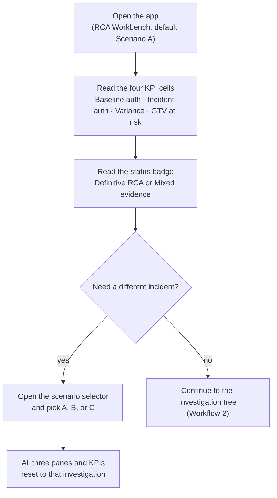
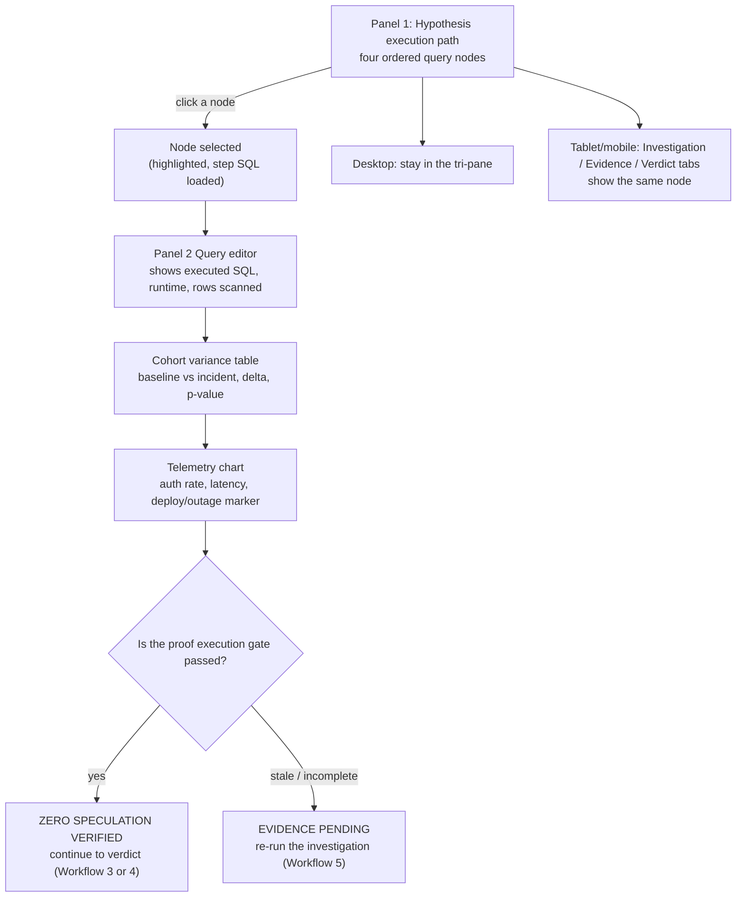
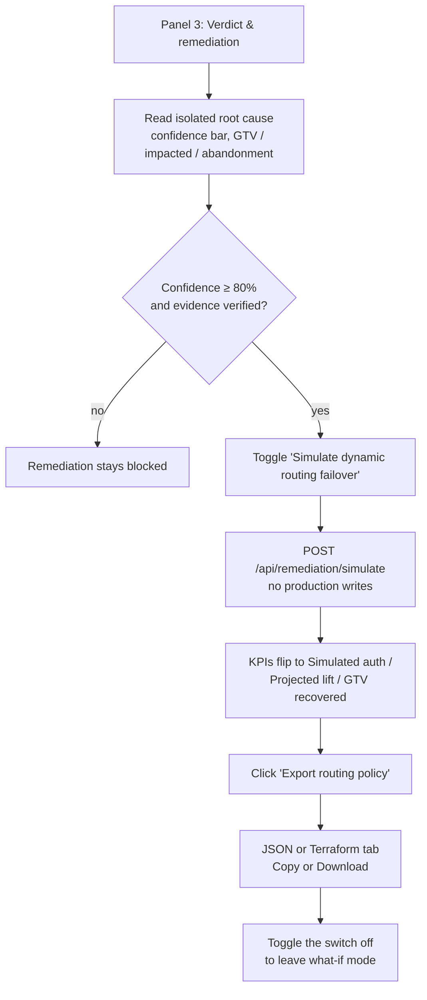
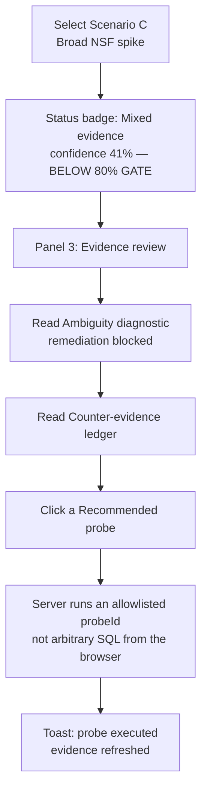
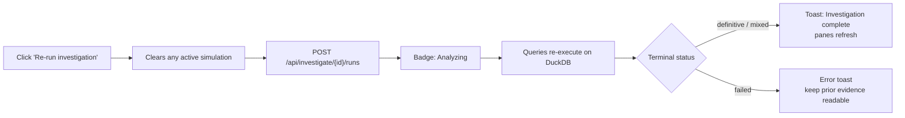

# How to Use Incident Insight

A walkthrough of every workflow implemented in the RCA cockpit (`src/routes/index.tsx` and
`src/features/rca/Workbench.tsx`), with the exact clicks each one takes. See `README.md` for how
to start the app and backend, `docs/FRONTEND_INTEGRATION_GUIDE.md` for the UI contract, and
`docs/BACKEND_IMPLEMENTATION.md` for the FastAPI + DuckDB API surface.

> **Current state:** the cockpit renders live investigation results from the FastAPI analytical
> service (`backend/`) against a seeded DuckDB ledger (`backend/data/synthetic_ledger.duckdb.gz`,
> unpacked on first start). Simulation and policy export are what-if operations: they compute
> recovered GTV and produce JSON/Terraform artifacts, but they never write to a live payment
> router. Mixed-evidence investigations block remediation entirely. The workflows below are
> exactly what's implemented today.

The app is a **single-screen tri-pane workbench** (desktop: Investigation 25% / Proof 48% /
RCA & action 27%). On smaller viewports the same three panes become **Investigation / Evidence /
Verdict** tabs. There is one linked investigation, not three independent screens — a scenario
change, a tree-node click, or a successful simulation updates the header KPIs together with every
pane.

---

## Workflow 1 — Select an investigation and read the incident strip

**Surface:** sticky header. This is where you start a session: pick which seeded incident to
analyze, confirm whether the engine returned a definitive RCA or mixed evidence, and read the
four KPI cells.

**Steps:**
1. Open the app — it lands on **Scenario A · Adyen UK 3DS timeout** with a **Definitive RCA**
   badge once the analytical service has returned completed evidence.
2. Read the four KPI cells: **Baseline auth**, **Incident auth**, **Variance** vs the matched
   baseline window, and **GTV at risk** (hourly modeled exposure). The subtitle on incident auth
   is the anomaly window (UTC).
3. Confirm the investigation status:
   - **Definitive RCA** — isolated root cause with confidence at or above the 80% remediation
     gate (Scenario A is 96%, Scenario B is 93%).
   - **Mixed evidence** — no isolated causal factor; remediation is hidden (Scenario C is 41%).
4. Open the scenario selector to switch investigations:
   - **Scenario A** — Adyen UK 3DS timeout after Deploy `#4481`.
   - **Scenario B** — Checkout.com Visa latency and soft-decline ramp.
   - **Scenario C** — Broad post-holiday NSF spike with mixed / inconclusive evidence.
5. Switching scenarios clears any active failover simulation and selects an appropriate
   evidence node (last completed node for definitive RCAs; the gateway-decomposition node for
   mixed evidence).

---

## Workflow 2 — Walk the hypothesis tree and inspect proof

This is the linked-evidence workflow. Clicking a node in **Investigation** updates the **Proof
workbench** SQL, cohort table, and chart context together. Every diagnosis you will read in
panel 3 is supposed to trace to one of these completed queries.

**Steps:**
1. In **Investigation**, read the four ordered hypothesis steps (for example: global baseline vs
   anomaly, gateway decomposition, dimensional slice, operational telemetry correlation). Each
   node shows a finding, runtime, rows scanned, and a status icon (success / anomaly /
   inconclusive).
2. Click a node. The **Proof workbench** title changes to that step. Confirm all three proof
   surfaces updated together:
   - read-only SQL (`{step_id}_analysis.sql`) with **Copy SQL**;
   - **Cohort variance** table (shift-and-lift vs matched baseline, with the **p < 0.05** gate);
   - **Auth rate & gateway latency** chart, with a data-driven marker (deploy, provider
     incident, or “Observed shift”).
3. Check the proof footer. **ZERO SPECULATION VERIFIED** appears only when the backend reports
   completed, current query evidence. If a re-run is in flight or evidence is stale, the footer
   and the tree gate show **EVIDENCE PENDING** / stale instead — they must not claim verification
   while queries are queued, running, failed, or stale.
4. On viewports below the `xl` breakpoint, use the **Investigation / Evidence / Verdict** tabs.
   They are a presentation switch only; they read the same investigation and the same selected
   node.

---

## Workflow 3 — Act on a definitive RCA (simulate failover, export policy)

**Surface:** **RCA & action** pane, shown when the investigation status is definitive (Scenarios
A and B). Confidence must be ≥ 80% and evidence must be complete; the backend rejects simulation
otherwise.

**Steps:**
1. Read **Isolated root cause**: title, narrative (`culprit_trigger`), confidence percentage, and
   the **4/4 TESTS PASSED** caption when evidence completed. Below it, the three impact cells
   (**GTV loss**, **Impacted**, **Abandonment**).
2. In **Remediation sandbox**, read the target rule (for example, “Route GB Debit Cards from
   Adyen → Checkout.com”). The subtitle is **What-if model · no production writes**.
3. Toggle **Simulate dynamic routing failover**. On success, the sandbox and the header KPIs
   move together to projected auth, lift vs incident, and recovered GTV. Export stays disabled
   until this mutation succeeds.
4. Click **Export routing policy**. Choose **JSON** or **Terraform**, then **Copy** or
   **Download**. The artifact is generated from the verified proposal and includes an evidence
   hash; downloading it does not activate the policy.
5. Toggle the switch off to leave simulation mode. The KPIs return to incident auth / variance /
   GTV at risk.

---

## Workflow 4 — Handle mixed evidence (counter-ledger and probes)

**Surface:** **RCA & action** pane, shown only for mixed investigations (Scenario C). Simulation
and policy export are not rendered. Do not treat this as a routing-change candidate.

**Steps:**
1. Select **Scenario C · Broad NSF spike**. The badge becomes **Mixed evidence**; header KPIs
   show a broad ~4.1pp auth drop without a gateway-specific isolation.
2. Open **Verdict** (or the right pane on desktop). You should see **Evidence review**, not
   **Verdict & remediation**. There is no failover switch and no export button.
3. Read the **Ambiguity diagnostic**: remediation is blocked because the evidence does not
   support a safe routing change.
4. Read the **Counter-evidence ledger** (uniform PSP variance, isolation gate not cleared, no
   overlapping deploy or provider incident).
5. Click a **Recommended probe** (28-day baseline, issuer BIN segment, merchant mix). The client
   sends a server-owned `probeId`; it does not submit arbitrary SQL. A toast reports completion
   and the investigation query is refreshed.

---

## Workflow 5 — Re-run the investigation against the ledger

Use this when you want the engine to execute the hypothesis DAG again (for example after a
stale-evidence warning). Re-run is a tracked backend operation, not a local timer.

**Steps:**
1. Click **Re-run investigation** in the header. Any successful simulation is cleared first.
2. The status badge shows **Analyzing** while the run is in flight. Completed node results stay
   readable rather than blanking the proof pane; the proof gate may show stale/pending until the
   new run finishes.
3. On success, a toast reports that hypothesis steps re-executed against the DuckDB ledger, and
   the tree / SQL / cohorts / verdict refresh from the new run.
4. If the analytical service is down, the page shows **Investigation service unavailable** with
   **Retry** instead of the cockpit.

---

## Quick reference: which pane for which question

| You want to... | Go to |
|---|---|
| Pick which incident to analyze (A / B / C) | Header scenario selector |
| See headline auth drop and GTV at risk | Header KPI strip |
| See which hypothesis step isolated (or failed to isolate) the cause | Investigation tree |
| Read the SQL that produced a claim, plus runtime and rows scanned | Proof workbench → query editor |
| Compare baseline vs incident by gateway, country, card, or decline code | Proof workbench → cohort variance |
| Align the drop with a deploy or provider incident | Proof workbench → telemetry chart |
| Read the isolated root cause and confidence | RCA & action → verdict |
| Estimate recovered GTV from a failover (definitive RCA only) | RCA & action → remediation sandbox |
| Download a JSON/Terraform routing override (after a successful simulation) | Export routing policy dialog |
| Understand why no routing change is safe | Scenario C → evidence review |
| Run an allowlisted follow-up query | Scenario C → recommended probes |
| Execute the DAG again against the ledger | Re-run investigation |
