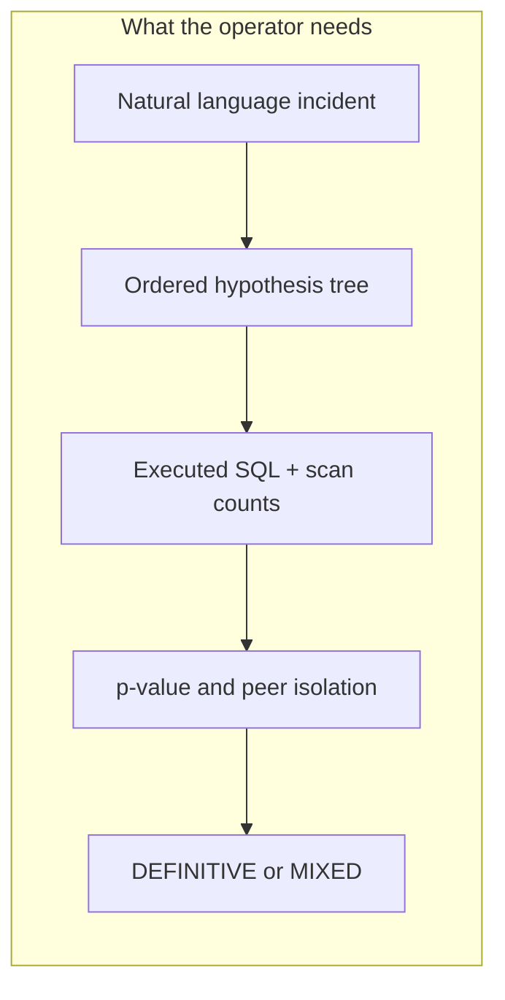
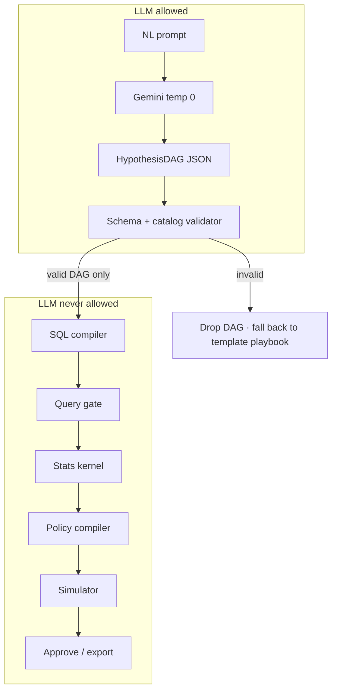
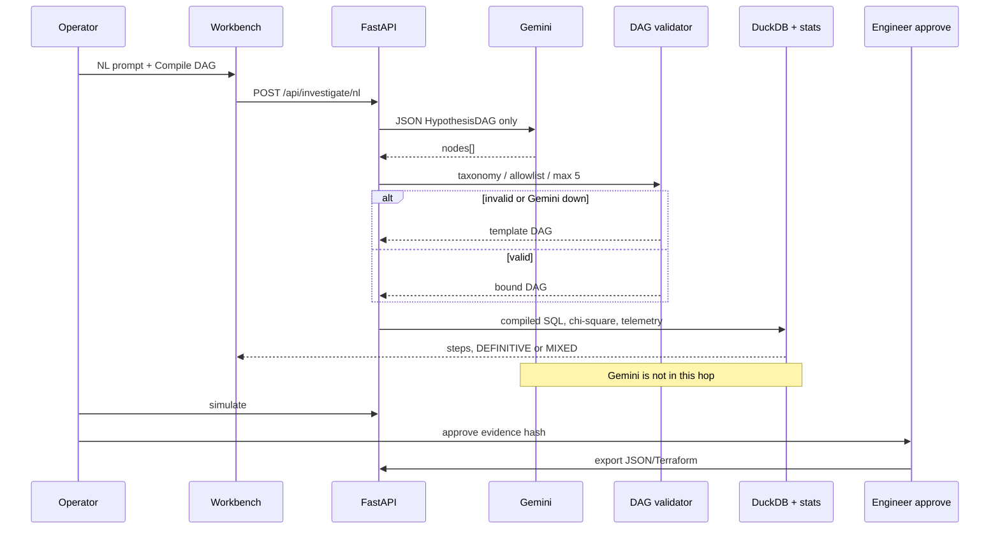
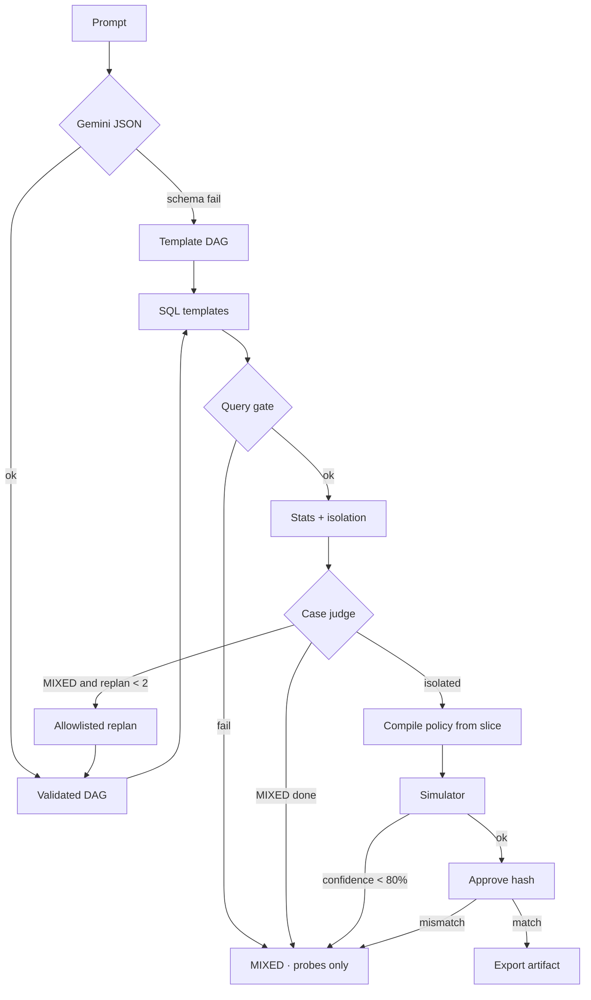

# LLM usage in Incident Insight

This document records **why** a language model is in the product, **what user problem** it is allowed to touch, the **analysis** that bounded that role, **how it is implemented**, and the **guardrails** that keep SQL, statistics, and routing out of the model.

Gemini is used **only** as a compiler from a natural-language incident description into a schema-validated `HypothesisDAG`. It is not the RCA engine. The model id is `gemini-3.6-flash` (Google’s current flash endpoint).

---

## 1. The user problem

Payments engineers already know the domain. In a war room they type something like:

> “Auth rate dropped 5% last Tuesday on Adyen UK debit after the 3DS deploy. What happened?”

What they lack is a **bounded investigation plan** that can be executed as deterministic SQL against the ledger, judged with p-values and isolation vs peers, and stopped at `MIXED_EVIDENCE` when the drop is uniform.

The failure mode of a general-purpose LLM is the opposite of that need: a fluent causal story with no query, no isolation test, and a routing rule invented in prose.

The language-shaped part of this job is **only the first arrow**: turning messy English into a typed DAG. Everything after that is math and an engineer’s approve.

---

## 2. Analysis: where an LLM is justified (and where it is not)

| Candidate use | Verdict | Reason |
|---|---|---|
| Plan hypotheses from an NL alert | **Use Gemini** | Language → constrained JSON. Temperature 0, frozen taxonomy. |
| Write SQL | **Forbidden** | Injection, silent schema drift, unauditable scans. Templates + bound parameters only. |
| Compute p-values / isolation | **Forbidden** | SciPy chi-square vs peers. Small *n* caps confidence; it does not invent MIXED by itself. |
| Synthesize policy JSON | **Forbidden** | Policy is compiled from the isolated slice keys. |
| Simulate recovered GTV | **Forbidden** | DuckDB counterfactuals + capacity. |
| Approve / export a route | **Forbidden** | Human + evidence hash. |

**Exact usage scenario:** Gemini runs if, and only if, the operator submits **Compile DAG** (or `POST /api/investigate/nl`) with a prompt. Scenario A/B/C **Re-run** and ordinary `GET /api/investigate/{id}` use the **template DAG** and never call Gemini.

---

## 3. How it is implemented

| Piece | Location | Behavior |
|---|---|---|
| Key | `GEMINI_API_KEY` in `backend/.env` (gitignored). Copy from `.env.example`. | Never committed. Loaded by `main.py`, `start.sh`, `start.ps1`. |
| Model | `gemini-3.6-flash` via `google-genai` | `temperature=0`, JSON MIME type. |
| Compiler | `backend/engine/gemini_compiler.py` | Prompt + frozen enums → JSON. No SQL in the instruction. |
| Schema | `backend/engine/dag.py` | Pydantic `HypothesisDAG`, max 5 nodes, acyclic, catalog `filter_value`. |
| Templates | `template_dag(scenario_id)` | Default playbook: global → gateway → dimensional drill. |
| SQL | `backend/engine/sql_compiler.py` | Allowlisted `SELECT … GROUP BY` expressions; filters as `?`. |
| Stats / judge | `stats.py`, `judge.py` | Isolation vs peers; CONFIRMED / REFUTED / MIXED. |
| Policy | `policy_compiler.py` | From confirmed gateway + drill keys. |
| Human gate | `POST /api/remediation/approve` then export | Evidence hash must match the last simulation. |

Health check: `GET /api/health` reports `llm` as the model id when a key is present, or `disabled`, and always `llm_role: hypothesis_dag_compiler`. Transient Gemini 503s are retried twice, then the template playbook is used (`planner_source: template_fallback`) so the cockpit never blocks on the model.

---

## 4. Guardrails

1. **No free SQL.** Nodes cannot carry a query string. The compiler only interpolates allowlisted column expressions.
2. **Catalog filters.** `filter_value` must be a known gateway, ISO country, brand, or card type. Anything else drops the DAG.
3. **Invalid DAG is not repaired by the model.** Validator failure → template playbook (`template_fallback`).
4. **Gemini never on production routes.** Query gate, stats, simulator, policy compile, simulate, approve, and export do not import the Gemini client.
5. **Query failure ≠ CONFIRMED.** Gate miss → MIXED; no policy.
6. **At most two MIXED replans**, each on an allowlisted dimension. Then MIXED is terminal.
7. **Taxonomy freeze.** New `hypothesis_type` is a code change.
8. **Confidence gate 80%** and evidence hash on approve. Hash mismatch → 409.
9. **MIXED never offers a happy-path route.** Probes only, and those SQL strings are seed-allowlisted.
10. **Secrets.** API keys live in gitignored `.env`. Rotate any key that was pasted into chat or a ticket.

For the operator click-path, see [`HOW_TO_USE.md`](HOW_TO_USE.md). For the cockpit wiring, see [`FRONTEND_INTEGRATION_GUIDE.md`](FRONTEND_INTEGRATION_GUIDE.md).
